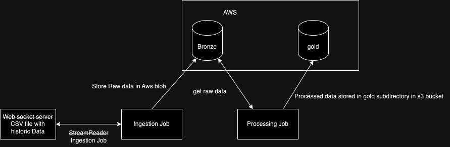

# Data Engineer Assignment

## Architecture choisit



Description: 

- Un bucket s3 a été instancié 
- Des données historisées des "trades d'énergies" sont mises à dispositions sous forme de CSV (Malheuresement, le streaming n'a pas été mis en place dans ce projet)
- Un job d'ingestion, appelé ingestion task, a pour but de lire ce CSV en entrée, et de les déposer sous forme de parquet dans le subdirectory bronze du bucket S3
- 3 jobs de raffinements sont disponibles, qui lisent les données bronze en entrées (historique des trades d'énergie)
et dépose le résultat sous forme de parquet dans le subdirectory gold du bucket s3:
  - average_financial_product_task: Calcul pour chaque produit financier son prix et volume moyen
  - highest_volume_financial_product_task: Calcul les 5 produits financiers ayant les plus gros volumes
  - anomalies_detection_financial_product_task: Détection d'anomalies dans le prix de produit financier

A noté que chaque job est indépendant les uns des autres

## Installation des librairies nécessaires

Créer un environnement virtuel qui contiendra les librairies python
```
python -m venv venv
source venv/bin/activate
```

Un makefile est mis à disposition. Pour obtenir de l'aide, taper la commande
```
make help
```

Pour installer les dépendences nécessaires au projet:
```
make install
```

## Création du package python eclipse

Création du wheel (qui sera déposé dans le dossier généré dist)
```
make build-package
```


## Installation du package

Installation du wheel localement
```
pip install dist/*
```

## Execution des jobs

#### Prérequis

Une fois le wheel installé, vous aurez besoin de remplir le ficher contenant les variables d'environnements (fichier .env).
Pour cela, éxécuter la commande:
```
cat .env.example > .env
```
et remplir les variables d'environnements dans le .env

Afin que les variables d'environnements soient disponibles dans votre bash, éxécuter la commande

```
export $(grep -v '^#' .env | xargs)
```

#### Job d'ingestion


Pour lancer le job d'ingestion, éxécuter la commande

```
eclipse-ingestion-task 

# Possibilité d'ajouter en argument le chemin du fichier d'entrée et de sortie

eclipse-ingestion-task --filename-input $INPUT_PATH --filename-output $OUTPUT_PATH
```
Les choix du fichier en entrée et en sortie sont choisis par défaut, mais peuvent être surchargés

#### Jobs de raffinement

Pour lancer les différents jobs de raffinage, éxécuter les commandes suivantes:

```
# Pour lancer le job average_financial_product_task

refining-task average_financial_product_task # --filename-input $FILENAME_INPUT

# Pour lancer le job highest_volume_financial_product_task

refining-task highest_volume_financial_product_task # --filename-input $FILENAME_INPUT

# Pour lancer le job anomalies_detection_financial_product_task

refining-task anomalies_detection_financial_product_task # --filename-input $FILENAME_INPUT

```
Le choix du fichier en entrée est choisit par défaut, mais peut être surchargé

## Execution des tests

Des tests unitaires ont été mis en place dans le dossier tests.

Pour éxécuter les tests unitaires, éxécuter la commande suivante:

```
make unit-tests
```

## Contenairisation des jobs:

Chaque job est associé à une image docker, définit dans le dossier docker. Afin de créer chaque image docker (les noms
 des images sont importants car écrit en dur dans le docker-compose), éxécuter les commandes suivantes:

```
# Build de l'image pour le job d'ingestion
docker build -f docker/Dockerfile.ingestion -t ingestion_job_image .

# Build de l'image pour le job de détection d'anomalies
docker build -f docker/Dockerfile.refining_anomalies_detection -t anomalies_detection_job_image .

# Build de l'image pour le job de calcul de prix et volume moyen par produit financier
docker build -f docker/Dockerfile.refining_average -t refining_average_job_image .

# Build de l'image pour le job d'ingestion des top 5 produit
docker build -f docker/Dockerfile.refining_top_volume -t refining_top_volume_job_image .

```

Pour lancer tout les jobs en même temps dans des containers séparés

```
docker compose up
```

## Infra as Code pour le bucket s3

#### Authent sur AWS via la cli

Afin d'instancier la ressource aws S3, une application terraform est mise à disposition
Assurez-vous dans un premier temps que l'awscli est bien installé

```
pip freeze | grep awscli
```

Si l'awscli n'est pas disponible, installer via pip la cli:

```
pip install awscli
```

Une fois la cli installé, renseigner les credentials via le prompt après taper la commande:

```
aws configure
```

#### Terraform

Afin d'installer les ressources terraform nécessaires:
```
cd terraform
terraform init
```

Des variables sont rentrées en dur pour le nom du bucket et le nom des sous dossiers, mais sont modifiables dans le
fichier de conf dev.auto.tfvars

Pour instancier / modifier votre infra :

```
terraform apply
```


## Reste à faire

- Implémenter la lecture sous forme de stream pour l'ingestion, et écriture de table delta (disponible via databricks)
- Déploiement des wheels via l'outil [dbx](https://docs.databricks.com/en/archive/dev-tools/dbx/dbx.html), 
permettant de déployer des packages python et de créer des workflows / jobs 
- Gestion des règles d'accès au bucket: Création de roles IAM via terraform
- Développement de tests d'intégrations
- Développement de tests end to end
- Développement de tests de qualités de données
- Refactoring des jobs de refining
- Mise à disposition d'outillage (amélioration du makefile)